# henrydrayton.github.io
# HTML/CSS Portfolio 
 

### Link (URL) to published portfolio website
https://peaceful-colden-d9dbc9.netlify.app/index.html

## Purpose
This project aims to develop a portfolio to display my competencies as a full-stack developer to prospective employers.  The platform is to be maintained throughout my professional career and will present my past and future work.  As I grow as a developer, the website needs to reflect this. The blog section is excellent for this as it allows for the chronological logging of projects. 

## Functionality / Features
There are several critical elements to my design that are concurrent with premium web platforms. The site contains a contact page directly linked to my email; this provides employers with an avenue for communication without listing my email or phone number on the internet. The page also has links to relative social platforms, including GitHub, LinkedIn and Twitter, so that users can view my entire professional internet presence. The website also features a resume button on the About page where employers can view or download my CV. On top of these functional attributes, the whole site follows a strict colour scheme of blues and purple, which elegantly contrast against grey shades. Font, Poppins is used for headers, Roboto for paragraphs and Days One for specific subheadings. 

## Sitemap

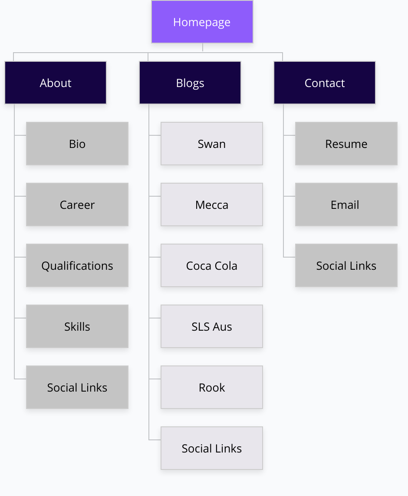

## Wireframes

## iPhone Renders

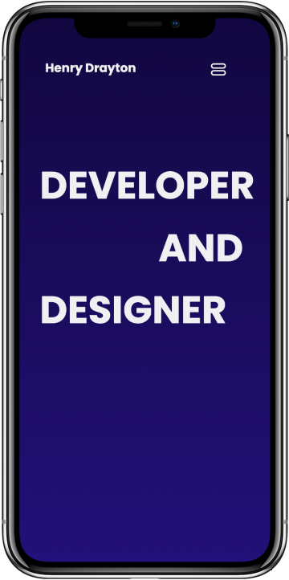
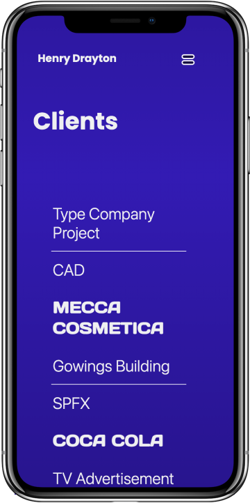

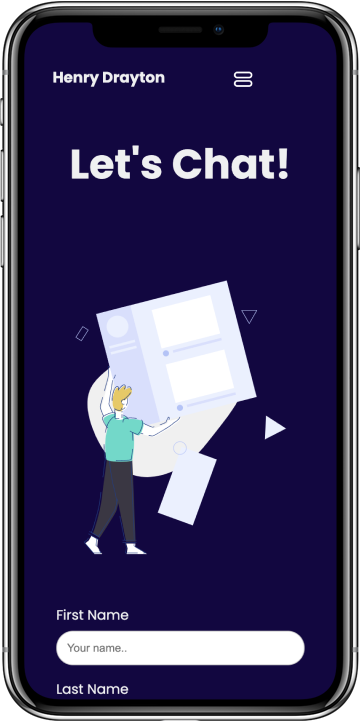
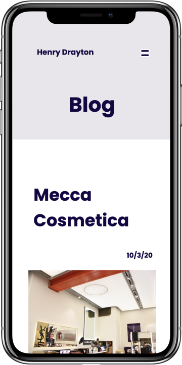

## iPad Renders

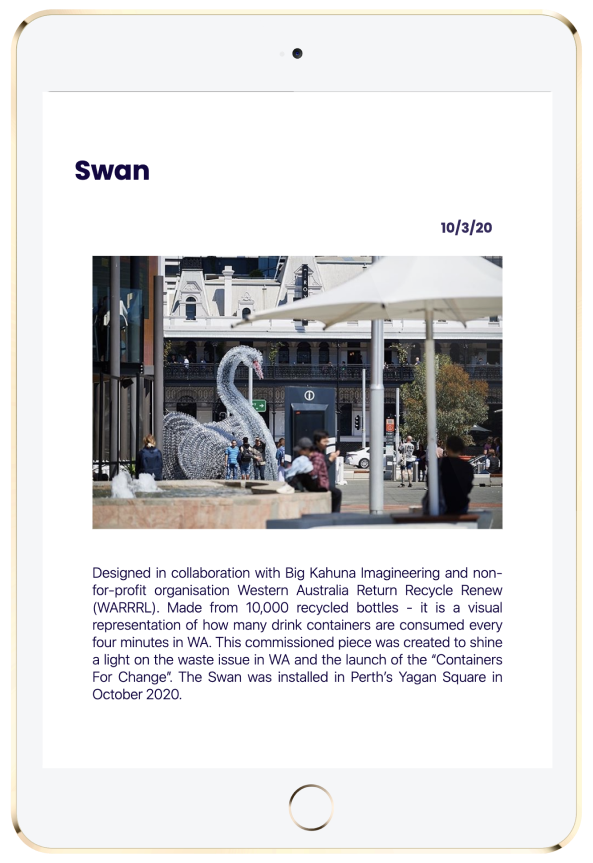
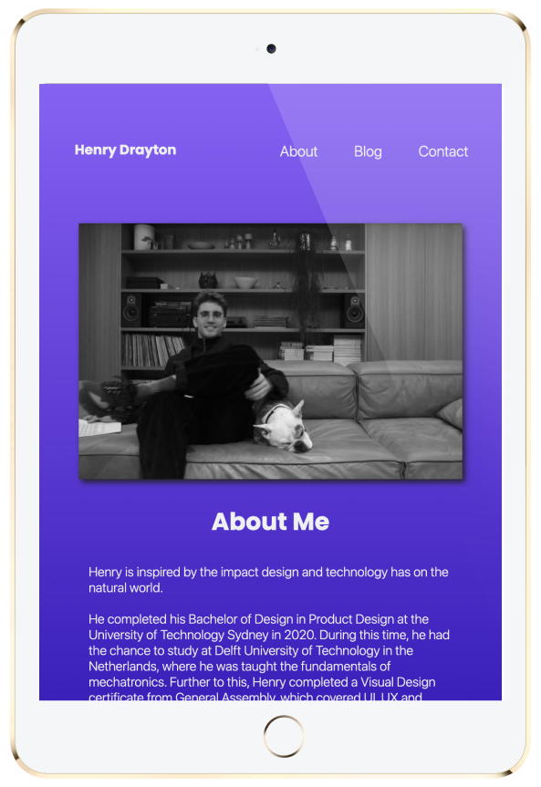

## Computer Renders

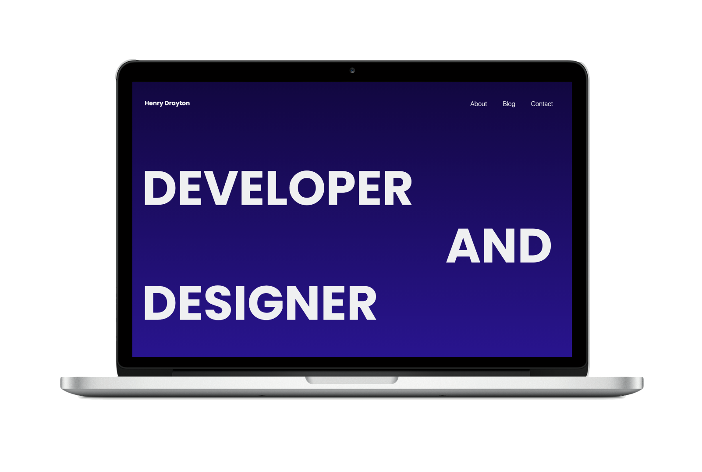
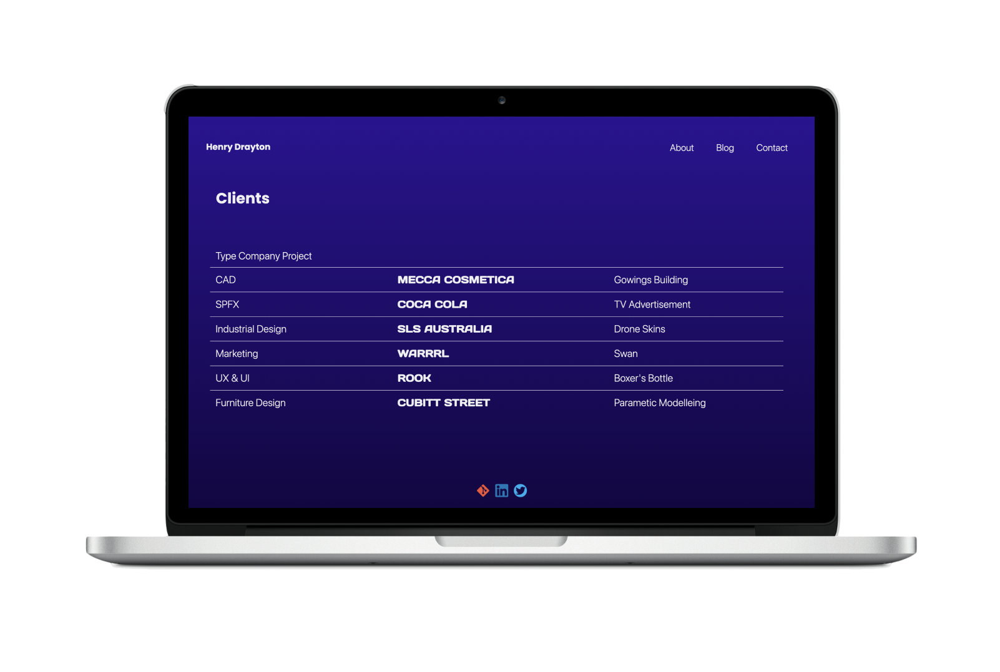
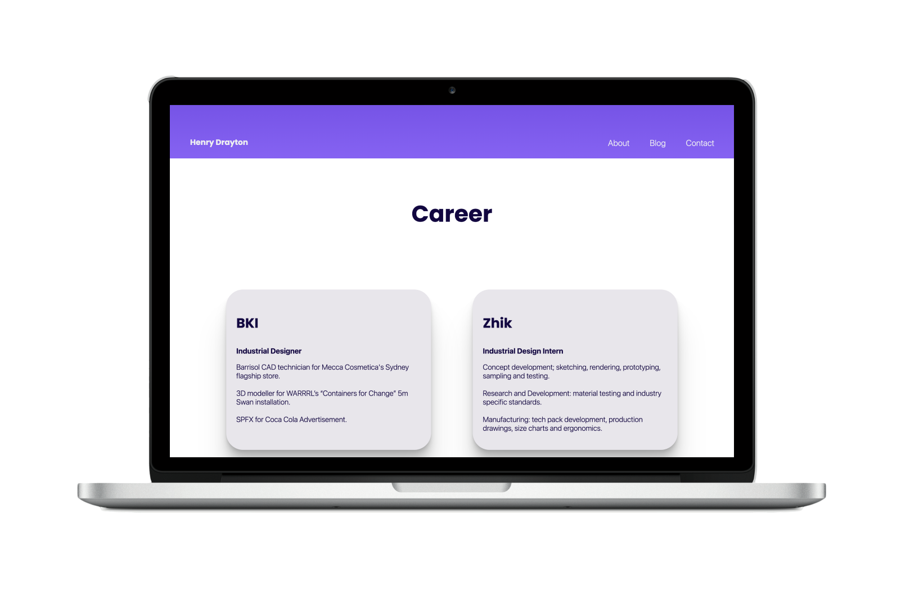
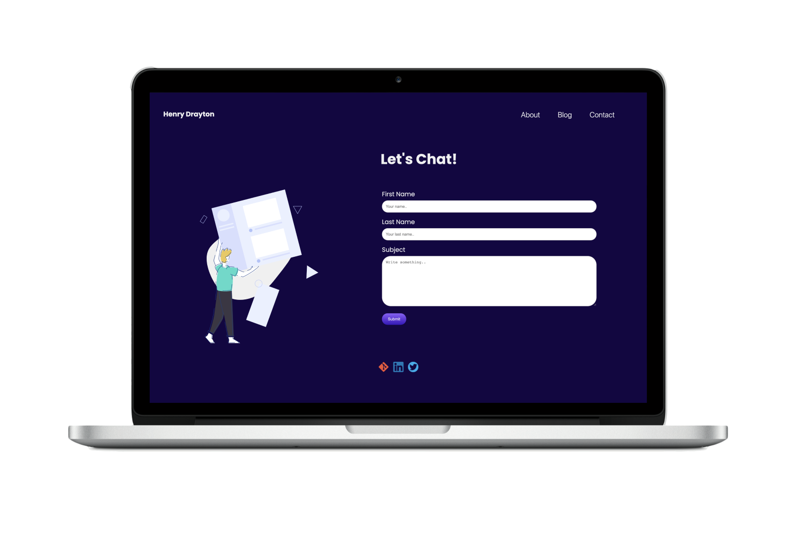

## Target audience

The website is specifically to target future employers or those within the professional developer sphere. To compete against experienced developers, all aspects of the platform must be highly refined and cater to multiple screen sizes.  The website’s layout and design resembles many common trends from leading  portfolios. This analysis of related competitors lets employers know that myself as a developer stays relevant to today’s design considerations. 

## Tech Stack

HTML, CSS, Netlify

