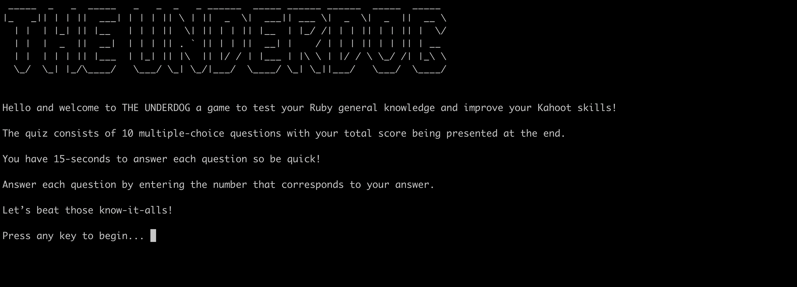
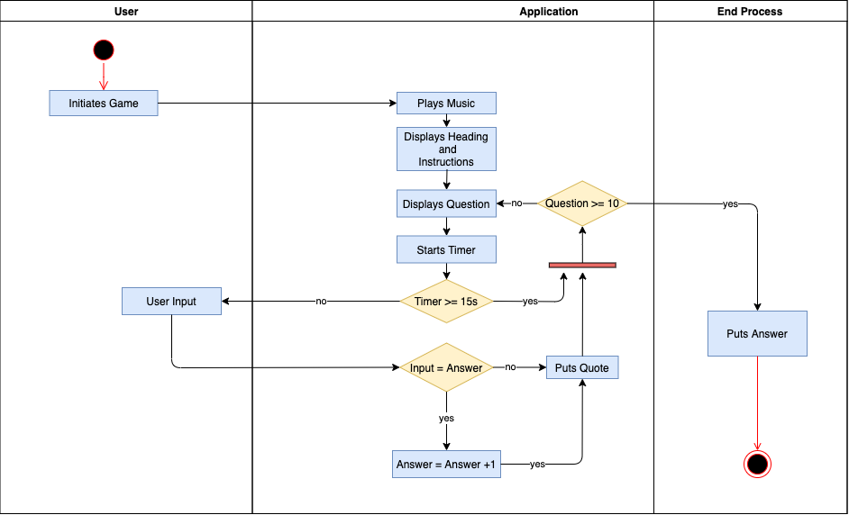
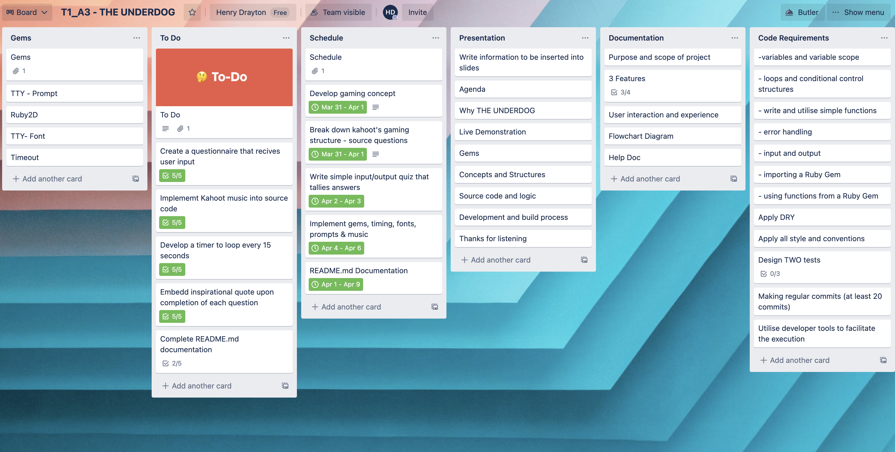

# Software Development Plan

## THE UNDERDOG 
###  Created by: Henry Drayton

.

Download the repository here: https://github.com/henrydrayton/henrydrayton.github.io/tree/main/T1_A3

Most people dread their morning commute; at Coder Academy, students often dread their morning Kahoot. It seems as though there are a select few who take the podium spot each morning, leaving the rest of the class to question their adequacy. This terminal application is designed for students to test their knowledge of Ruby outside of class, preparing them for battle the next day. Accompanied by the monotonous Kahoot soundtrack, a fifteen-second time limit and inspirational quotes, this application turns students into an army that even William Wallace would be proud of. THE UNDERDOG is explicitly for Coder Academy students; however, it is also beneficial for anyone looking to refresh their Ruby general knowledge. Although the final application does not present the same graphical qualities as seen in Kahoot, it mentally prepares students and develops the quick hands required on game day. 

When first starting the game, the title THE UNDERDOG  features a sizable graphical font display. The game works by first prompting the user with a question. Each question has up to four possible answers as well as a corresponding number to enter. The player answers each question by entering the relevant number and is only allowed one attempt per question. Their final score displays on completion of the quiz. Inspirational quotes also appear after each question to encourage users on their quest for knowledge and further mimic the Kahoot game.

## Functionality and Features

### Music 
One of the most defining features of the Kahoot game is its recognisable soundtrack. If listened to indefinitely, it would put any human into a manic episode; however, for the game, it is ideal. The MP3 file executes in the terminal app through the Ruby2D gem installed. The music plays in a loop and does not end until the application terminates. When playing THE UNDERDOG, ensure the volume is on for maximum gaming experience. 

### Timer
Another signifying aspect of the Kahoot game is its fifteen-second time limit for each question. The time limit tests competitor’s knowledge and awards users for quick thinking. Although the complex points system does not feature in this terminal app, it is still beneficial for students game-day preparations. The timer uses loops and control-flow statements to function. After fifteen seconds, regardless if the player has answered, the next question appears, so be quick!

### User Input
User input is fundamental to the success of the game. The user answers each question by entering the corresponding number listed next to the options. The answers are collected and presented to the users upon completion. The users can compare their responses to the correct answers and get a score out of ten. 

### Inspirational Quotes
The application presents inspirational quotes after each question. The Colorize gem creates the blue text distinguishing the quotes from the questions. 

## User Experience and Interaction

For the game to be beneficial to the users, the commands must be easy to interpret. When the user launches the game, a graphical heading and a set of instructions display on the screen. These easy to read instructions cover the rules and how the user should answer each question. The user presses any key to begin and the timer starts its countdown. Error handling is used within the Timeout gem with the rescue command. If the timer reaches the fifteen-second limit, the program records nil for that question. The user answers each question by typing the number which corresponds to their answer and then hitting enter. The user’s input is displayed on the screen once they respond to the question as a form of visual feedback. The user’s final score is presented to them at the end as a value /10. The user can also compare their answers to the correct answers to check where they may have gone wrong. 

## Control Flow and Logic

.

 ## Implementation Plan 

View the Trello board here: https://trello.com/b/oTfnxE5I/t1a3

I created this Trello board at the very start of the project to outline and plan my app’s development process. The plan is in six segments, Gems, To DO, Schedule, Presentation, Documentation and Code Requirements. Within the To Do section, there are checklists that I marked every time I completed a task. The schedule section allowed me to keep track of allocated time periods to avoid getting caught up on unnecessary features.

 .

### Testing

| Test no.      | Feature |        Test Type       |  Expected Outcome  | Test Steps |      Actual Outcome  | 
| ----------- | ----------- | ----------|-----------|----------|--------|
| 1     | KahootMusic      |    Manual: Testing if sountrack commences after pressing key to begin.        |        Sountrack plays and continuously loops until terminated   |     1. Key to begin. 2. Wait for sountrack to play full length. 3. Wait for loop. 4. Terminate     | TRUE
| 2   |shared       |  Manual: Testing if user scores are accurately calculated      |  All correct answers =+ 1         |    1. Answer correctly 2. If score = 10/10 3. Answer incorrectly 4. If score <10      |TRUE
| 3    | Timeout       |  Manual: Testing Timeout gem loops until all questions complete            |  Loops until all questions complete then terminates         |   1. Commence game 2. Wait till all questions terminate 3. If true- terminate game       |TRUE
| 4   | answer        |  Manual: Testing if blank answers = nil and do not contribute to final score         |  All blank answers = nil, do not contribute to score         |    1. Commence game 2. Wait till all questions terminate 3. If score = 0/10      |TRUE

 ## Help

### Installation Instructions

First, install the Ruby program here https://www.ruby-lang.org/en/documentation/installation/

Download the GitHub repository above. 

Download Bundler in your command line by typing this 

        gem install bundler     

Then run this command. 

        bundle install

To launch the application, run this command. 

        ruby THE_UNDERDOG.rb

### Dependencies for the application
Please ensure all of the following Gems are downloaded and required before commencing the program. 
<ul>

<li> gem "ruby2d", "~> 0.9.5" </li>
<li> gem "tty-prompt", "~> 0.23.0" </li>
<li> gem "tty-font", "~> 0.5.0" </li>
<li> gem "colorize", "~> 0.8.1" </li>
<li> gem "timeout", "~> 0.1.1" </li>

</ul>